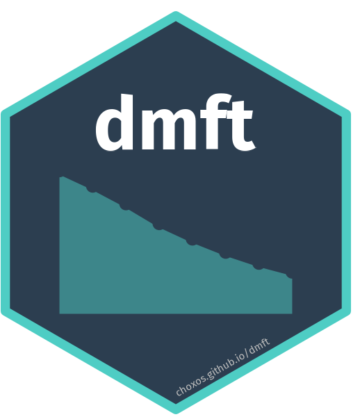

# dmft 

<!-- badges: start -->
[](https://github.com/choxos/dmft/actions/workflows/R-CMD-check.yaml)
[](https://lifecycle.r-lib.org/articles/stages.html#experimental)
[](https://choxos.github.io/dmft/)
<!-- badges: end -->

**dmft** implements the Age-Spatial-Temporal (AST) model for estimating and projecting dental caries burden (DMFT/dmft indices) at subnational level for any country.

**Documentation**: <https://choxos.github.io/dmft/>

## Features

- **Two-stage AST modeling**: mixed-effects model (lme4) + kernel-smoothed residuals across age, space, and time
- **Spatial smoothing** via adjacency-based weight matrices from shapefiles
- **Temporal smoothing** using LOESS-inspired cubic power weights
- **Age smoothing** with exponential decay kernels
- **Bootstrap uncertainty** via multilevel model resampling
- **Projection framework** with reference, optimistic, and pessimistic scenarios
- **Publication-ready visualizations**: choropleth maps, temporal trends, uncertainty ribbons
- **Country-agnostic**: works with any shapefile and study-level data

## Installation

``` r
# Install from GitHub
pak::pak("choxos/dmft")

# Or with remotes
remotes::install_github("choxos/dmft")
```

## Quick Start

``` r
library(dmft)

# 1. Configure the analysis for your country
cfg <- dmft_config(
  regions = c("Region_A", "Region_B", "Region_C", "Region_D"),
  region_col = "province",
  year_range = c(2000, 2020),
  projection_range = c(2021, 2030)
)

# 2. Run the full pipeline
results <- dmft_run(
  data_path = "my_data.csv",
  shapefile_path = "my_regions.shp",
  config = cfg
)

# 3. Visualize
dmft_plot_map(results$estimates$permanent, results$adjacency$sf, year = 2020)
dmft_plot_trends(results$estimates$permanent, results$projections$permanent)
```

### Step-by-step usage

``` r
# Load and clean data
raw <- dmft_load("data.csv", config = cfg)
clean <- dmft_clean(raw, config = cfg)

# Create spatial structure
adj <- dmft_adjacency(shapefile_path = "regions.shp", config = cfg)

# Fit mixed-effects model
fit <- dmft_fit(clean$permanent, adj, dentition = "permanent", config = cfg)

# AST smoothing + bootstrap uncertainty
estimates <- dmft_predict(fit, adj, config = cfg)

# Diagnostics
diagnostics <- dmft_diagnose(fit, config = cfg)

# Project future trends
projections <- dmft_project(fit, estimates, config = cfg)
```

## Input Data Format

The input CSV/XLSX should contain study-level summary statistics with at minimum:

| Column | Description |
|--------|-------------|
| `province` (or your `region_col`) | Region name |
| `year` | Year of data collection |
| `age_start` | Start of age range |
| `age_end` | End of age range |
| `mean_dmft` and/or `mean_DMFT` | Mean dmft (deciduous) / DMFT (permanent) |
| `n` | Sample size (optional, used for weighting) |
| `sd_dmft` / `se_dmft` | Standard deviation / error (optional, imputed if missing) |

## Model

The package uses a two-stage AST (Age-Spatial-Temporal) approach:

**Stage 1 --- Mixed-effects model (lme4)**

```
y_i ~ Normal(mu_i, se_i^2)

mu_i = beta_0 + [covariates] + b_region + b_year

b_region ~ Normal(0, sigma_region^2)   [random intercepts]
b_year   ~ Normal(0, sigma_year^2)     [random intercepts]
```

**Stage 2 --- AST kernel smoothing of residuals**

Residuals from Stage 1 are smoothed using weighted averaging across three dimensions:

- **Spatial**: adjacency-based weights (par_space = 0.9)
- **Temporal**: LOESS cubic power decay (par_time = 2)
- **Age**: exponential decay (par_age = 1)

The combined weight matrix is the Kronecker product of these three weight matrices, row-normalized to sum to 1.

## License

MIT
