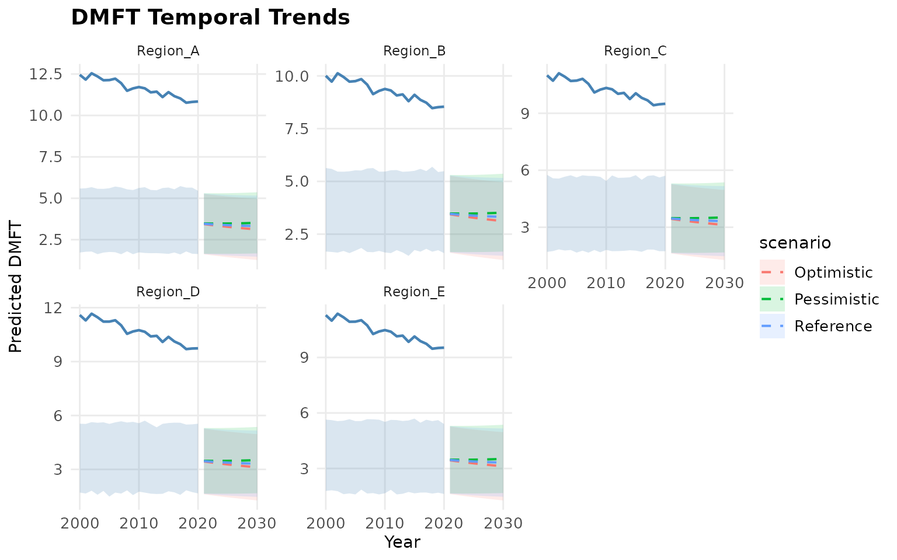

# Getting Started with dmft

## Overview

The **dmft** package implements the Age-Spatial-Temporal (AST) model for
estimating and projecting dental caries burden (DMFT/dmft indices) at
subnational level. It uses a two-stage approach:

1.  **Stage 1**: A random intercept mixed-effects model via `lme4` (or
    optionally Stan for the Bayesian backend).
2.  **Stage 2**: AST kernel smoothing of residuals across space, time,
    and age dimensions using Kronecker-product weight matrices.

This tutorial walks through the full analysis pipeline using synthetic
(phantom) data.

## Installation

``` r
# Install from GitHub
pak::pak("choxos/dmft")
```

For the experimental Bayesian backend, also install cmdstanr:

``` r
install.packages("cmdstanr",
                  repos = c("https://stan-dev.r-universe.dev", getOption("repos")))
cmdstanr::install_cmdstan()
```

## Step 1: Configuration

Every analysis begins with
[`dmft_config()`](https://choxos.github.io/dmft/reference/dmft_config.md),
which defines the regions, time period, age groups, and model
parameters.

``` r
library(dmft)

cfg <- dmft_config(
  regions = c("Region_A", "Region_B", "Region_C",
              "Region_D", "Region_E"),
  region_col = "province",
  year_range = c(2000, 2020),
  projection_range = c(2021, 2030),
  age_groups_deciduous = c("0-4", "5-9", "10-14"),
  age_groups_permanent = c("5-9", "10-14", "15-19", "20-24",
                           "25-29", "30-34", "35-39", "40-44",
                           "45-49", "50-54", "55-59", "60+"),
  ast_params = list(
    par_space = 0.9,
    par_time = 2,
    par_age = 1,
    weight_coverage = 0.9
  ),
  n_boot = 200,
  seed = 42
)

cfg
#> ℹ DMFT analysis configuration
#>   Regions:      5 (Region_A, Region_B, Region_C, ...)
#>   Historical:   2000-2020 (21 years)
#>   Projections:  2021-2030
#>   Age groups:   deciduous=3, permanent=12
#>   AST params:   space=0.9, time=2, age=1
#>   Covariates:   none
#>   Bootstrap:    200 replicates
#>   Seed:         42
```

Key parameters:

- **`regions`**: Character vector of subnational region names. These
  must match your data and shapefile.
- **`region_col`**: The column name in your data containing region
  names.
- **`year_range`**: Historical period `c(start, end)`.
- **`projection_range`**: Future projection period (optional).
- **`ast_params`**: Smoothing parameters for the AST kernel (see Model
  Details below).
- **`n_boot`**: Number of bootstrap replicates for uncertainty
  intervals.
- **`covariates`**: Optional fixed-effect covariates (column names in
  your data).

## Step 2: Generate Phantom Data

For demonstration, we generate synthetic data. In practice, you would
load your own CSV/XLSX with
[`dmft_load()`](https://choxos.github.io/dmft/reference/dmft_load.md).

``` r
phantom <- dmft_phantom(cfg, dentition = "permanent", n_per_cell = 2)
#> ✔ Generated 2142 phantom records
head(phantom)
#>                         study province year age_start age_end    sex   n
#> 1   phantom_Region_A_2000_5-9 Region_A 2000         5       9 Female  73
#> 2   phantom_Region_A_2000_5-9 Region_A 2000         5       9   Male  69
#> 3 phantom_Region_A_2000_10-14 Region_A 2000        10      14   Male 332
#> 4 phantom_Region_A_2000_10-14 Region_A 2000        10      14 Female 261
#> 5 phantom_Region_A_2000_20-24 Region_A 2000        20      24 Female  73
#> 6 phantom_Region_A_2000_20-24 Region_A 2000        20      24   Male 185
#>   mean_DMFT sd_DMFT
#> 1      1.50    0.98
#> 2      0.58    1.26
#> 3      3.03    1.95
#> 4      3.44    1.69
#> 5      8.25    2.55
#> 6      9.49    2.83
```

The phantom data mimics realistic study-level data with known
age-by-region patterns, a temporal trend, and random missingness.

### Loading Your Own Data

``` r
# From CSV
raw <- dmft_load("path/to/your_data.csv", config = cfg)

# From Excel
raw <- dmft_load("path/to/your_data.xlsx", config = cfg)
```

Your data should have at minimum:

| Column                                | Description                                               |
|---------------------------------------|-----------------------------------------------------------|
| Region column (matching `region_col`) | Region name                                               |
| `year`                                | Year of data collection                                   |
| `age_start`                           | Start of age range                                        |
| `age_end`                             | End of age range                                          |
| `mean_dmft` and/or `mean_DMFT`        | Mean dmft (deciduous) / DMFT (permanent)                  |
| `n`                                   | Sample size (optional, used for weighting)                |
| `sd_dmft` / `se_dmft`                 | Standard deviation / error (optional, imputed if missing) |

## Step 3: Data Cleaning

[`dmft_clean()`](https://choxos.github.io/dmft/reference/dmft_clean.md)
performs column standardization, region name mapping, age group
assignment, outlier flagging, and uncertainty imputation.

``` r
clean <- dmft_clean(phantom, config = cfg)
#> ✔ Cleaned: 360 deciduous, 2142 permanent records
names(clean)
#> [1] "deciduous" "permanent"
```

The result is a list with `$deciduous` and `$permanent` tibbles. Each
has standardized columns including `se_imputed` for inverse-variance
weighting.

``` r
str(clean$permanent[, c("region_std", "year", "age_group", "mean_DMFT",
                         "se_imputed", "se_source")])
#> tibble [2,142 × 6] (S3: tbl_df/tbl/data.frame)
#>  $ region_std: chr [1:2142] "Region_A" "Region_A" "Region_A" "Region_A" ...
#>  $ year      : num [1:2142] 2000 2000 2000 2000 2000 2000 2000 2000 2000 2000 ...
#>  $ age_group : chr [1:2142] "5-9" "5-9" "10-14" "10-14" ...
#>  $ mean_DMFT : num [1:2142] 1.5 0.58 3.03 3.44 8.25 ...
#>  $ se_imputed: num [1:2142] 0.115 0.152 0.107 0.105 0.298 ...
#>  $ se_source : chr [1:2142] "from_sd_n" "from_sd_n" "from_sd_n" "from_sd_n" ...
```

### Uncertainty Imputation

The package uses a hierarchical strategy to ensure every observation has
a standard error:

1.  Use SE if reported directly
2.  Compute SE from SD and sample size
3.  Compute SE from confidence intervals
4.  Estimate SD from a default coefficient of variation (CV), then
    compute SE

You can control the default CV via `cv_default` in
[`dmft_config()`](https://choxos.github.io/dmft/reference/dmft_config.md).

## Step 4: Spatial Adjacency

[`dmft_adjacency()`](https://choxos.github.io/dmft/reference/dmft_adjacency.md)
builds the neighbourhood graph from a shapefile. Since we are using
phantom data without a real shapefile, we construct a simple adjacency
manually:

``` r
# For real data, use:
# adj <- dmft_adjacency(shapefile_path = "regions.shp", config = cfg)

# For phantom data, create a mock adjacency
adj_matrix <- matrix(0, 5, 5)
rownames(adj_matrix) <- colnames(adj_matrix) <- cfg$regions
# Chain topology: A-B-C-D-E
adj_matrix[1,2] <- adj_matrix[2,1] <- 1
adj_matrix[2,3] <- adj_matrix[3,2] <- 1
adj_matrix[3,4] <- adj_matrix[4,3] <- 1
adj_matrix[4,5] <- adj_matrix[5,4] <- 1

# Build spdep neighbourhood
nb <- list()
for (i in 1:5) nb[[i]] <- as.integer(which(adj_matrix[i,] == 1))
class(nb) <- "nb"
attr(nb, "region.id") <- cfg$regions

adj <- list(
  adj_matrix   = adj_matrix,
  nb           = nb,
  sf           = NULL,
  location_ids = setNames(1:5, cfg$regions)
)
```

With real shapefiles, the function handles Queen contiguity, island
detection, and automatic region name matching.

## Step 5: Model Fitting (Frequentist)

[`dmft_fit()`](https://choxos.github.io/dmft/reference/dmft_fit.md) runs
Stage 1 of the AST methodology: a random intercept mixed-effects model
via [`lme4::lmer()`](https://rdrr.io/pkg/lme4/man/lmer.html).

``` r
fit <- dmft_fit(
  data      = clean$permanent,
  adjacency = adj,
  dentition = "permanent",
  config    = cfg
)
#> ℹ Model data: 2142 obs, 5 regions, years 2000-2020
#> ℹ Fitting lme4 model (permanent): y ~ 1 + (1 | region_std) + (1 | year_factor)
#> ✔ lme4 fit complete in 1s (AIC=14788.8, BIC=14811.4)
```

The model formula is:

    y ~ 1 + [covariates] + (1|region_std) + (1|year_factor)

with inverse-variance weights from `se_imputed`.

### Adding Covariates

To include fixed-effect covariates:

``` r
cfg_cov <- dmft_config(
  regions = cfg$regions,
  region_col = "province",
  year_range = c(2000, 2020),
  covariates = c("fluoridation_pct", "sugar_consumption")
)
```

## Step 6: Predictions with AST Smoothing

[`dmft_predict()`](https://choxos.github.io/dmft/reference/dmft_predict.md)
applies Stage 2 (AST kernel smoothing) and computes bootstrap
uncertainty intervals.

``` r
estimates <- dmft_predict(fit, adj, config = cfg, n_boot = 100)
#> ℹ Computing bootstrap uncertainty (100 replicates)...
#> ✔ Predictions: 1260 cells (permanent)
head(estimates)
#> # A tibble: 6 × 6
#>   region    year age_group predicted lower upper
#>   <chr>    <int> <chr>         <dbl> <dbl> <dbl>
#> 1 Region_A  2000 10-14          3.47  1.38  5.55
#> 2 Region_A  2000 15-19          5.34  1.47  5.73
#> 3 Region_A  2000 20-24          7.29  2.00  5.52
#> 4 Region_A  2000 25-29          9.32  1.62  5.53
#> 5 Region_A  2000 30-34         11.3   1.95  5.83
#> 6 Region_A  2000 35-39         13.5   1.23  6.03
```

The result is a tibble with one row per region-year-age_group cell:

- `predicted`: AST-smoothed point estimate
- `lower`, `upper`: 95% bootstrap confidence intervals

### How AST Smoothing Works

Residuals from Stage 1 are smoothed using three kernel weight matrices:

1.  **Spatial**: Adjacency-based weights with parameter `par_space`
    (default 0.9). Self-weight is high; adjacent regions get moderate
    weight; non-adjacent get zero.
2.  **Temporal**: LOESS-style cubic power weights with parameter
    `par_time` (default 2). Nearby years get high weight, distant years
    get low weight.
3.  **Age**: Exponential decay with parameter `par_age` (default 1).
    Adjacent age groups get high weight, distant groups get low weight.

The combined weight matrix is the Kronecker product:
`W = kronecker(space_mat, kronecker(age_mat, time_mat))`, row-normalized
to sum to 1.

## Step 7: Diagnostics

[`dmft_diagnose()`](https://choxos.github.io/dmft/reference/dmft_diagnose.md)
computes fit statistics, residual diagnostics, spatial autocorrelation
tests, and prediction validity checks.

``` r
diag <- dmft_diagnose(fit, config = cfg)
#> Warning in deviance.merMod(fit): deviance() is deprecated for REML fits; use
#> REMLcrit for the REML criterion or deviance(.,REML=FALSE) for deviance
#> calculated at the REML fit
#> ℹ Diagnostics (PERMANENT)
#>   AIC=14788.8  BIC=14811.4
#>   RMSE=9.500  MAE=7.589  Bias=6.8087
#>   Var(year_factor): 0.1139 (SD=0.3374)
#>   Var(region_std): 0.0838 (SD=0.2894)
#>   Var(Residual): 0.8671 (SD=0.9312)
#>   Moran's I: stat=-1.1351, p=0.2563 (OK)
#>   Predictions: range [2.97, 4.34], 0<0, 0>28
```

Key diagnostic outputs:

``` r
# Fit statistics
diag$fit_stats
#>     metric     value
#> 1      AIC 14788.758
#> 2      BIC 14811.436
#> 3   logLik -7390.379
#> 4 deviance 14780.758

# Variance components
diag$variance_components
#>         group   variance        sd
#> 1 year_factor 0.11386961 0.3374457
#> 2  region_std 0.08377718 0.2894429
#> 3    Residual 0.86708501 0.9311740

# Residual metrics
cat(sprintf("RMSE: %.3f\nMAE:  %.3f\nBias: %.4f\n",
            diag$residuals$rmse, diag$residuals$mae, diag$residuals$bias))
#> RMSE: 9.500
#> MAE:  7.589
#> Bias: 6.8087

# Spatial autocorrelation (Moran's I)
if (!is.na(diag$spatial$p.value)) {
  cat(sprintf("Moran's I: %.4f (p = %.4f)\n",
              diag$spatial$statistic, diag$spatial$p.value))
}
#> Moran's I: -1.1351 (p = 0.2563)
```

A non-significant Moran’s I (p \> 0.05) suggests the AST smoothing has
adequately captured spatial structure.

## Step 8: Projections

[`dmft_project()`](https://choxos.github.io/dmft/reference/dmft_project.md)
extrapolates temporal trends with three scenarios:

- **Reference**: continuation of the observed trend
- **Optimistic**: accelerated improvement (default: -0.02/year
  adjustment)
- **Pessimistic**: slower improvement (default: +0.02/year adjustment)

``` r
projections <- dmft_project(fit, estimates, config = cfg)
#> ✔ Projected 10 years across 3 scenarios
head(projections)
#> # A tibble: 6 × 5
#>    year scenario  mean_proj lower upper
#>   <int> <chr>         <dbl> <dbl> <dbl>
#> 1  2021 Reference      3.46  1.63  5.29
#> 2  2022 Reference      3.44  1.61  5.26
#> 3  2023 Reference      3.41  1.59  5.24
#> 4  2024 Reference      3.39  1.57  5.22
#> 5  2025 Reference      3.38  1.55  5.21
#> 6  2026 Reference      3.36  1.53  5.19
```

The trend is estimated from the last 10 years of year random effects,
with damping (default 0.95 per year) to prevent unrealistic
extrapolation.

## Step 9: Visualization

### Temporal Trends

``` r
dmft_plot_trends(estimates, projections)
```



### Choropleth Maps

With a real shapefile:

``` r
dmft_plot_map(estimates, adj$sf, year = 2020)
```

## Full Pipeline

For convenience,
[`dmft_run()`](https://choxos.github.io/dmft/reference/dmft_run.md)
orchestrates all steps in a single call:

``` r
results <- dmft_run(
  data_path      = "my_data.csv",
  shapefile_path = "my_regions.shp",
  config         = cfg,
  dentition      = "permanent"
)

# Access results
results$estimates$permanent
results$diagnostics$permanent
results$projections$permanent
```

## Bayesian Backend (Experimental)

The Bayesian backend uses Stan (via cmdstanr) for Stage 1 instead of
lme4. It provides posterior credible intervals instead of bootstrap
intervals.

### Setup

``` r
install.packages("cmdstanr",
                  repos = c("https://stan-dev.r-universe.dev", getOption("repos")))
cmdstanr::install_cmdstan()
```

### Step-by-Step

``` r
# Fit with Stan
fit_b <- dmft_fit_bayes(
  data      = clean$permanent,
  adjacency = adj,
  dentition = "permanent",
  config    = cfg
)

# AST smoothing + posterior credible intervals
estimates_b <- dmft_predict_bayes(fit_b, adj, config = cfg)

# Bayesian diagnostics (Rhat, ESS, LOO-CV)
diag_b <- dmft_diagnose_bayes(fit_b, config = cfg)

# Projections using posterior draws
proj_b <- dmft_project_bayes(fit_b, estimates_b, config = cfg)
```

### Full Pipeline (Bayesian)

``` r
results_b <- dmft_run(
  data_path      = "my_data.csv",
  shapefile_path = "my_regions.shp",
  config         = cfg,
  backend        = "bayesian"
)
```

### Custom Stan Settings

``` r
cfg_bayes <- dmft_config(
  regions = c("Region_A", "Region_B", "Region_C"),
  region_col = "province",
  year_range = c(2000, 2020),
  stan_settings = list(
    chains        = 4,
    iter_warmup   = 1000,
    iter_sampling = 1000,
    adapt_delta   = 0.95,
    max_treedepth = 12
  )
)
```

### Bayesian Diagnostics

The Bayesian diagnostics include:

- **Rhat**: Should be \< 1.01 for all parameters
- **ESS** (bulk and tail): Should be \> 400
- **Divergences**: Should be 0
- **LOO-CV**: Leave-one-out cross-validation via `loo::loo()`
- **Posterior predictive checks**: Coverage of observed data by
  posterior predictive intervals
- **Variance decomposition**: From posterior draws of sigma parameters

## Model Details

### Stage 1: Mixed-Effects Model

The model for observation $i$:

$$y_{i} \sim \text{Normal}\left( \mu_{i},\sigma^{2} + \text{se}_{i}^{2} \right)$$

$$\mu_{i} = \beta_{0} + X_{i}\beta + b_{\text{region}{\lbrack i\rbrack}} + b_{\text{year}{\lbrack i\rbrack}}$$

$$b_{\text{region}} \sim \text{Normal}\left( 0,\sigma_{\text{region}}^{2} \right)$$

$$b_{\text{year}} \sim \text{Normal}\left( 0,\sigma_{\text{year}}^{2} \right)$$

Where $\text{se}_{i}$ is the known (or imputed) standard error for each
study, providing inverse-variance weighting.

### Stage 2: AST Kernel Smoothing

Residuals $r_{i} = y_{i} - {\widehat{y}}_{i}$ are smoothed using:

$${\widehat{r}}_{a,t,s} = \sum\limits_{a\prime,t\prime,s\prime}W_{a,a\prime} \cdot W_{t,t\prime} \cdot W_{s,s\prime} \cdot r_{a\prime,t\prime,s\prime}$$

where the weight matrices are:

- **Spatial**: $W_{S}(i,j) = \rho$ if $i = j$, $\rho(1 - \rho)$ if
  adjacent, 0 otherwise
- **Temporal**:
  $W_{T}(i,j) = \left( 1 - \left( |i - j|/T \right)^{\lambda} \right)^{3}$
  (LOESS cubic power)
- **Age**: $W_{A}(i,j) = \exp\left( - \omega|i - j| \right)$
  (exponential decay)

The combined weight matrix is: $W = W_{S} \otimes W_{A} \otimes W_{T}$
(Kronecker product), row-normalized.

Final estimates:
${\widehat{y}}_{a,t,s} = {\widehat{\mu}}_{a,t,s} + {\widehat{r}}_{a,t,s}$

## References

- Shoaee S, et al. (2022). Subnational estimation of dental caries
  burden. *BMC Oral Health*, 22:634.
- Shoaee S, et al. (2025). Subnational estimation using AST models. *BMC
  Oral Health*, 25:1490.
- Foreman KJ, et al. (2012). Modeling causes of death: an integrated
  approach using CODEm. *Population Health Metrics*, 10:1.
